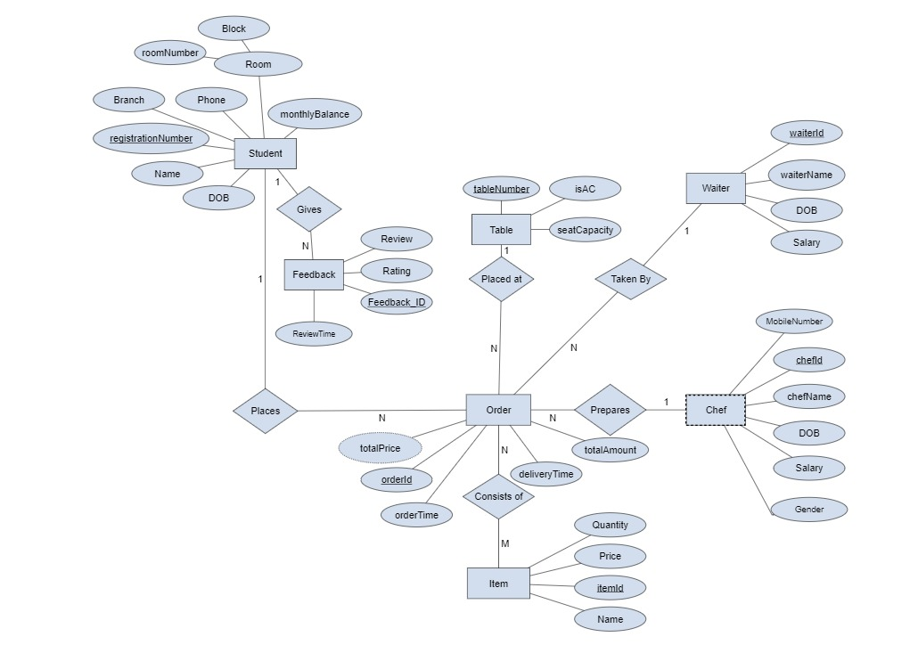
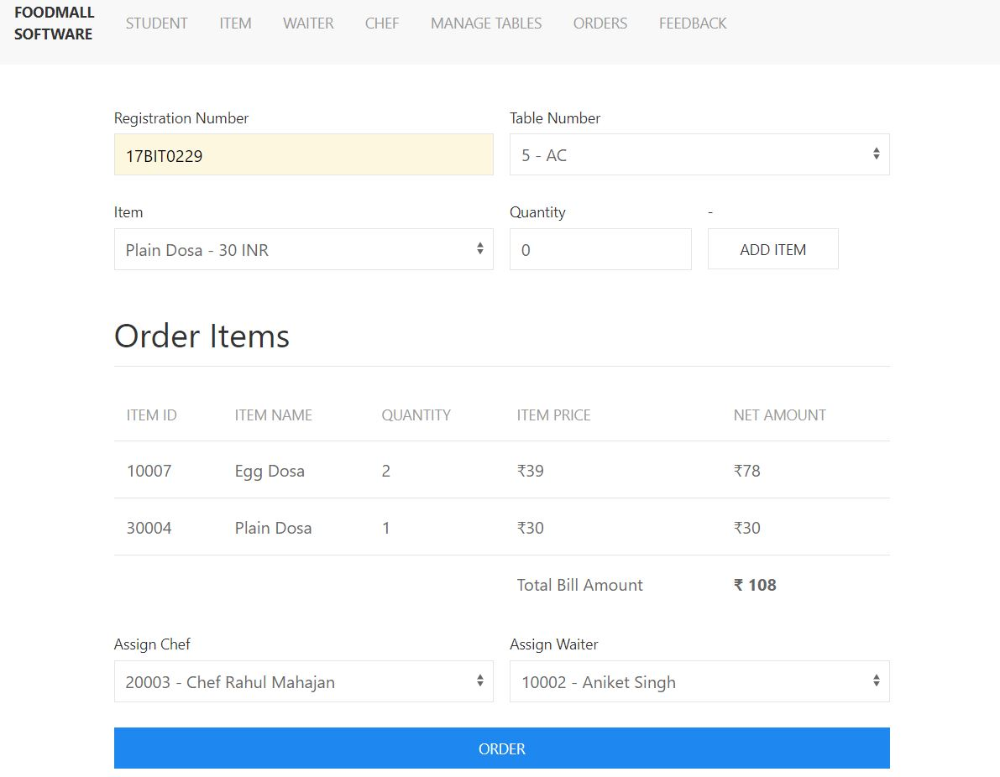
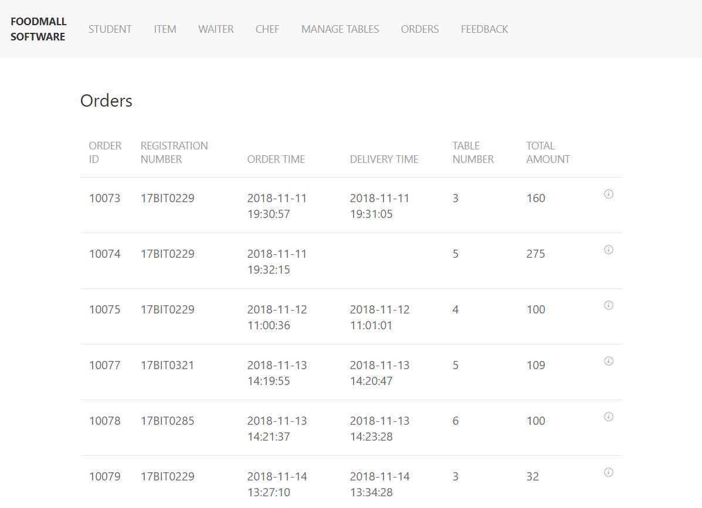
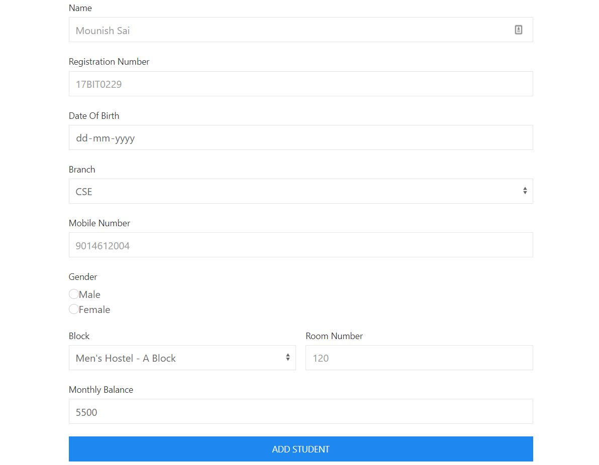
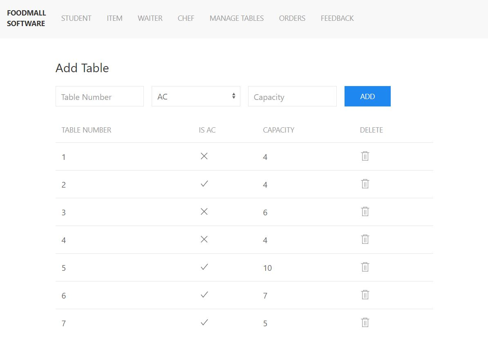
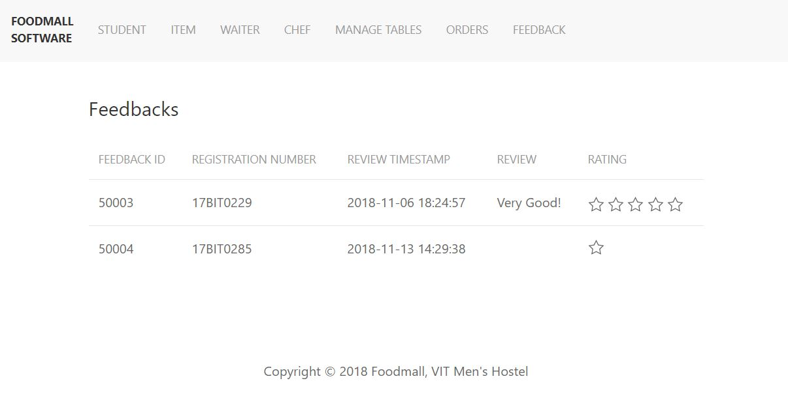

# Foodmall Management Software

VIT Hostel's **Foodmall Management Software** makes the Foodmall to run smoothly. The mission of this project is to facilitate easy management and administration of the foodmall in VIT with capabilities to do Billing of the orders, Communication among the employees, Observing and Analysing reports/statistics, adding and removing students for each month, Total monthly billing etc. using the computerized food mall management software.

Technologies used:
- NodeJS (Express) 
- SQLite3

## Installation

First, clone the project.

```bash
git clone https://github.com/pvsmounish/foodmall-management.git
```
Use the package manager npm to install dependencies.
Run the following command in root directory.

```bash
npm install
```
Run the project.

```bash
npm start
```

## ER Diagram



## Relational Schema


## Screenshots

Adding New Order.  


Show all Orders.  


Add New Student.  


Add/Show Tables.  


Show Feedbacks.  



## Contributing
Pull requests are welcome. For major changes, please open an issue first to discuss what you would like to change.


## License
[GNU General Public License v3.0](https://www.gnu.org/licenses/gpl-3.0.en.html)
